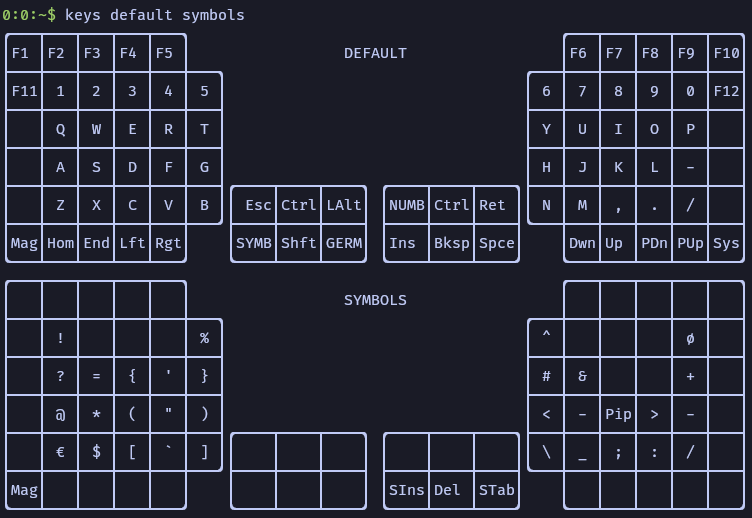

# MoErgo Glove80 Custom Configuration for ZMK

This is the ZMK configuration of my MoErgo Glove80 wireless split contoured keyboard.
Most of the configuration is inside the [glove80.keymap](config/glove80.keymap) file.

For your own configuration, you might want to create your own configuration based on
the [MoErgo Glove80 template repo](https://github.com/moergo-sc/glove80-zmk-config).

The `bin/keys` tool is build in rust and can be found at [github.com:f0i/glove80-keys).

## Features

- Separate layers for typing (DEFAULT), programming symbols (SYMBOLS), special characters (GERMAN), and data input (NUMBLOCK).
- Thumb clusters with modifier keys on the left thumb, and white space on the right thumb.
- Shift is ignored for number keys and most symbols. This prevents some unwanted characters, especially with sticky shift enabled.
- Colon and semicolon are shifted dot and comma ',' -> ';', '.' -> ':'.
- Avoids function and number keys, as well as outer column of keys.

## Requirements

- A [Glove80](https://www.moergo.com/collections/glove80-keyboards), obviously
- Host should be set to use a German layout! For English layouts you would have to remove the `DE_*` prefix from several keys.

## Layers

The keymaps can be shown using the `bin/keys` command, which greps the [glove80.keymap](config/glove80.keymap) to get the latest layouts.

## Symbol layer objectives

Ordered by priority, starting with highest: 

- Must only use keys where letters are placed in the DEFAULT layer
- Keys `,.` turn into `;:`, the same as with shift key
- Keys `-/` are already in base layer and are kept at the same position
- Frequently used keys should be plcaed easy to type positions (e.g. for left side: f, d, s, r, e, w, a, ..., z)
- Name of symbols should reflect letters in typing layer (`* star`, `+ plus`, `` ` backtick``, `' tick`, `? question mark`, `@ at`, `& und`, `! inverted i`, `= eqWal sign`, `% o/o`, `$ jQuery`, `~ nautical`)
- Common patterns should avoid usage of the same finger twice in a row (`()`, `="`, ``, ``, ``)
- Similar symbols should be placed in some kind of pattern (e.g. `()`, `{}`, `[]`, `<>`, `{([<`, `})]>`, `+-`, `&|`, ``'`"``, `\/`)

### Examples of other symbol layers

- https://getreuer.info/posts/keyboards/symbol-layer/index.html
  - Great summary of different symbol layers for split keyboards

- https://sunaku.github.io/ergohaven-remnant-keyboard.html#symbol-layer
  - Popular in the glove80 community
  - places all symbols on the left half of the keyboard
  - makes use of the number and outer pinky keys as well as the lowest row [-]

- https://my.glove80.com/#/layout/user/c2cc9af8-e3d9-44c5-9845-fd0e7799e49a

- https://elixirforum.com/t/an-elixir-optimized-keyboard-layout/20730/9
  - bracket paris placed on both halfs [+]

## Firmware Files

1. Download the glove80.uf2 from the latest run in [Github Actions](https://github.com/f0i/glove80/actions)
2. Put the Glove80 in bootloader mode (Magic + outer home row key)
3. Copy over the glove80.uf2 file and wait for it to reboot.

