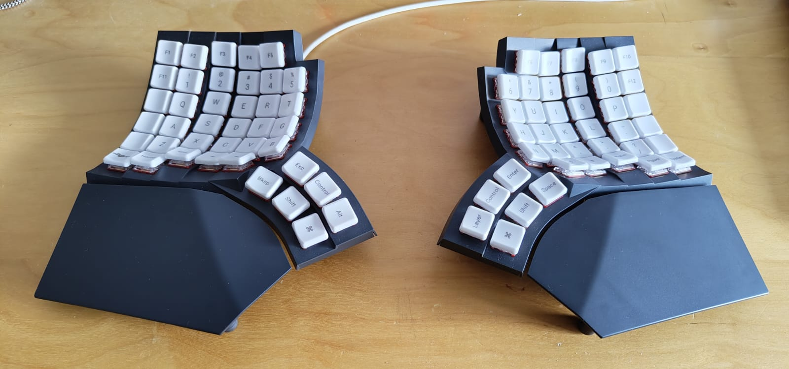

# MoErgo Glove80 Custom Configuration for ZMK

This is the ZMK configuration of my MoErgo Glove80 wireless split contoured keyboard.
Most of the configuration is inside the [glove80.keymap](config/glove80.keymap) file.

## Resources

For your own configuration, you might want to create your own configuration based on
the [MoErgo Glove80 template repo](https://github.com/moergo-sc/glove80-zmk-config).

## Firmware Files

1. Download the glove80.uf2 from the latest run in [Github Actions](https://github.com/f0i/glove80/actions)
2. Put the Glove80 in bootloader mode (Magic + outer home row key)
3. Copy over the glove80.uf2 file and wait for it to reboot.

